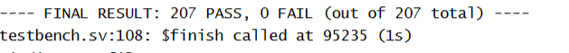
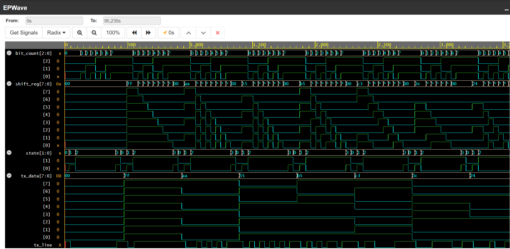
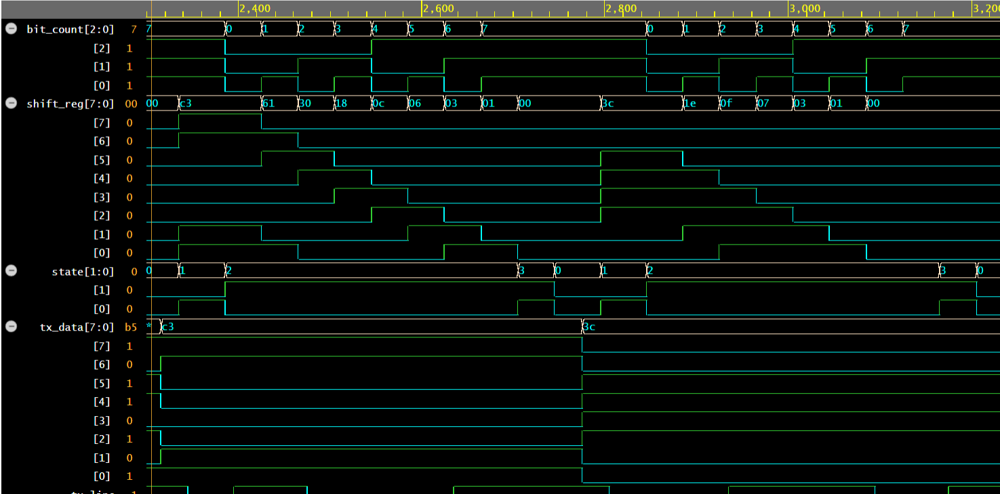

# UART TX FSM — RTL Design & Verification

A UART transmitter (TX-only) built in Verilog, using a finite state machine to
serialize an 8-bit byte per standard UART framing: START bit, 8 data bits
(LSB first), STOP bit. Verified with a self-checking testbench achieving
**207/207 PASS** across directed, back-to-back, and randomized test vectors.

## Design Overview

The transmitter cycles through four states per byte:

```
IDLE → START → DATA (8 bits) → STOP → IDLE
```

- **IDLE** — `tx_line` held high, waiting for `tx_start`
- **START** — `tx_line` pulled low for one bit period, signaling the receiver
- **DATA** — 8 bits shifted out LSB-first, one bit per bit period
- **STOP** — `tx_line` returns high for one bit period, framing the byte

A parameterized baud-rate generator (`BAUD_DIV`) sets the clock cycles per
bit period, decoupling the design from any specific clock/baud combination
(e.g. `BAUD_DIV = 5208` for a 50 MHz clock at 9600 baud). The baud counter
resets whenever a new transmission begins, ensuring every byte starts with a
full, correctly-timed bit period regardless of the counter's prior phase.

## Ports

| Signal      | Direction | Width | Description                              |
|-------------|-----------|-------|-------------------------------------------|
| `clk`       | input     | 1     | System clock                              |
| `rst_n`     | input     | 1     | Active-low reset                          |
| `tx_start`  | input     | 1     | Pulse to begin transmitting `tx_data`     |
| `tx_data`   | input     | 8     | Byte to transmit                          |
| `tx_line`   | output    | 1     | Serial output line                        |
| `tx_busy`   | output    | 1     | High while a transmission is in progress  |

## Verification Methodology

Built a self-checking testbench with an independent "virtual receiver" that
samples `tx_line` at the mid-point of each bit period, reconstructs the
transmitted byte, and automatically compares it against the expected value —
the same directed + randomized methodology used on the
[8-bit ALU project](https://github.com/Sattwik-8/alu-8bit-verilog).

**Test coverage:**
- 5 directed vectors targeting bit-pattern edge cases: `0x00`, `0xFF`, `0xAA`,
  `0x55`, and a mixed pattern (`0xB5`)
- 1 back-to-back transmission test (`0xC3` immediately followed by `0x3C`,
  zero idle gap) — specifically targets baud-counter re-synchronization at
  the start of a new byte
- 200-vector randomized regression sweep

**Result: 207/207 PASS, 0 failures.**



## Debugging Notes

Four distinct timing bugs were found and fixed during verification, each
caught by the self-checking testbench rather than manual waveform inspection:

1. **Reset-release race** — reset was deasserted exactly on a clock edge,
   causing ambiguous first-cycle behavior. Fixed by offsetting the release
   to mid-cycle.
2. **Baud-counter synchronization** — the baud counter was free-running from
   reset rather than resetting at the start of each transmission, causing
   the START bit's duration to depend on the counter's phase at the moment
   `tx_start` fired. Fixed by resetting the counter whenever a new
   transmission begins.
3. **Testbench sampling race** — the testbench sampled `tx_line` on the same
   clock edge the DUT updates it, occasionally catching a stale value.
   Fixed by offsetting testbench-driven signal changes by a small delay
   after the clock edge.
4. **Bit-sampling offset** — samples were taken at bit-period boundaries
   rather than mid-bit, risking captures during signal transitions. Fixed by
   sampling at the middle of each bit period, matching real UART receiver
   practice.

## Waveforms

**Single-byte transmission (`0xAA`)** — full IDLE → START → DATA → STOP cycle:



**Back-to-back transmission (`0xC3` → `0x3C`, zero idle gap):**



## Repository Structure

```
uart-tx-fsm-verilog/
├── design.sv       # UART TX FSM + baud-rate generator
├── testbench.sv    # Self-checking testbench (directed + regression)
├── images/         # Waveform and result screenshots
└── README.md
```

## Tools

Icarus Verilog · EDA Playground · EPWave

## Related

- [8-bit ALU — RTL Design & Verification](https://github.com/Sattwik-8/alu-8bit-verilog)
